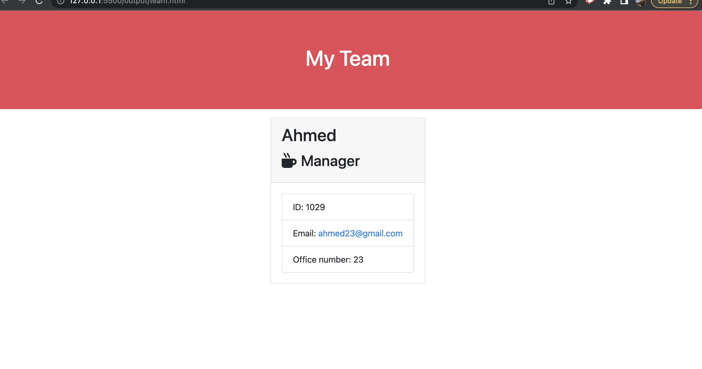
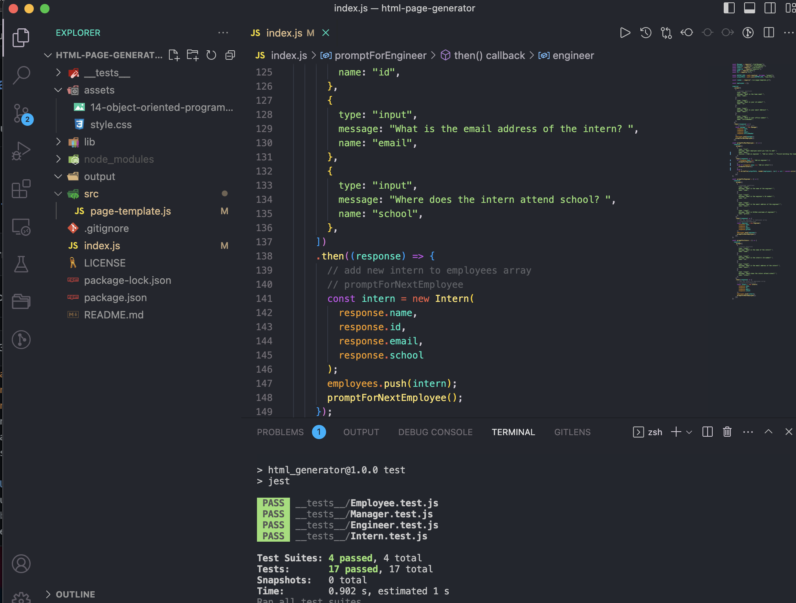

## User Story

As a manager a user want to generate a webpage that displays my team's basic info so that a user have quick access to their emails and GitHub profiles.

## Instructions
 
* A command-line application that accepts accepts user input using the provided starter code.   
  * Classes for each team member provided and export them. The tests for these classes (in the `_tests_` directory) must ALL pass.     
    * The first class is an `Employee` parent class with the following properties and methods:       
      * `name`
      * `id`
      * `email`
      * `getName()`
      * `getId()`
      * `getEmail()`
      * `getRole()`&mdash;returns `'Employee'`     
    * The other three classes will extend `Employee`.      
    * In addition to `Employee`'s properties and methods, `Manager` will also have the following:
      * `officeNumber`
      * `getRole()`&mdash;overridden to return `'Manager'`
    * In addition to `Employee`'s properties and methods, `Engineer` will also have the following:
      * `github`&mdash;GitHub username
      * `getGithub()`
      * `getRole()`&mdash;overridden to return `'Engineer'`
    * In addition to `Employee`'s properties and methods, `Intern` will also have the following:
      * `school`
      * `getSchool()`
      * `getRole()`&mdash;overridden to return `'Intern'`
    * Finally, although it’s not a requirement, consider adding validation to ensure that user input is in the proper format.   
  * Code in the `index.js` uses inquirer to gather information about the development team members and creates objects for each team member using the correct classes as blueprints.
    * When a user starts the application then they are prompted to enter the **team manager**’s:
      * Name
      * Employee ID
      * Email address
      * Office number
    * When a user enters those requirements then the user is presented with a menu with the option to:
      * Add an engineer
      * Add an intern 
      * Finish building the team
    * When a user selects the **engineer** option then a user is prompted to enter the following and then the user is taken back to the menu:
      * Engineer's Name
      * ID
      * Email
      * GitHub username
    * When a user selects the intern option then a user is prompted to enter the following and then the user is taken back to the menu:
      * Intern’s name
      * ID
      * Email
      * School
    * When a user decides to finish building their team then they exit the application, and the HTML is generated.
    * The `render` function will generate and return a block of HTML including templated divs for each employee!
    * Write it to a file named `team.html` in the `output` folder. 
    * You can use the provided variable `outputPath` to target this location.
## Mock-Up

## Test
* application uses jest for test the functionality of the app
* to run a test type npm run test in the terminal

